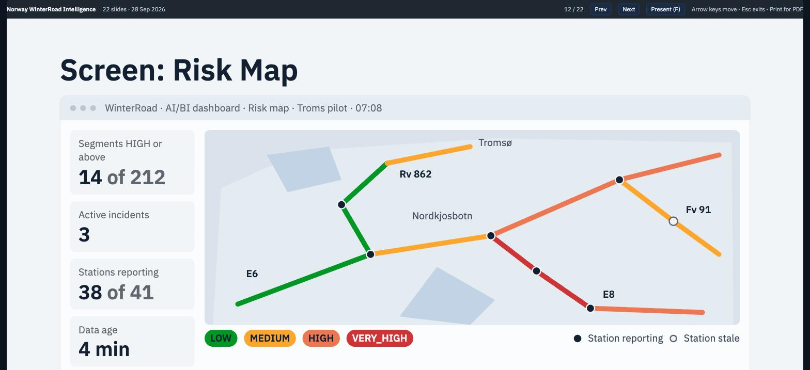
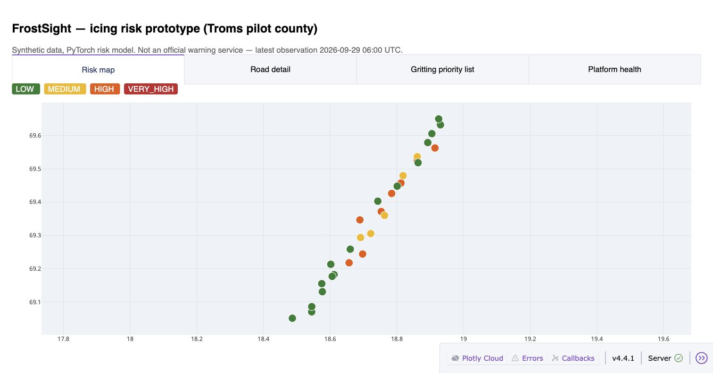
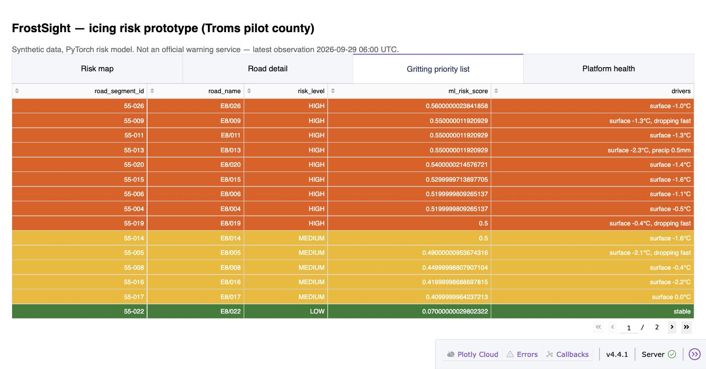
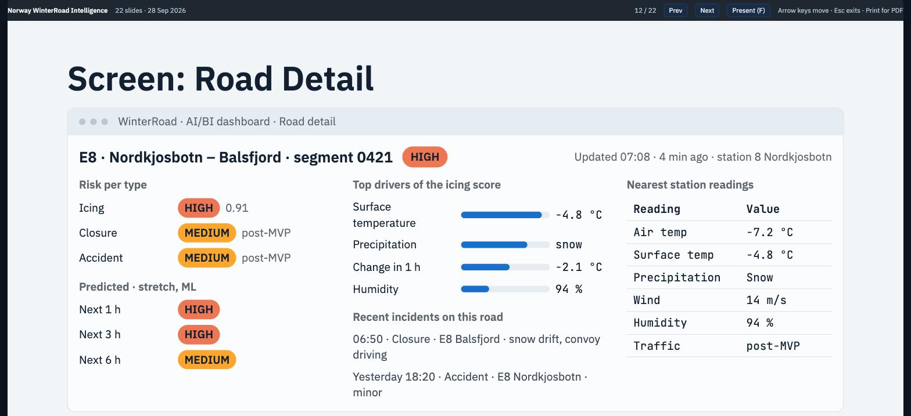
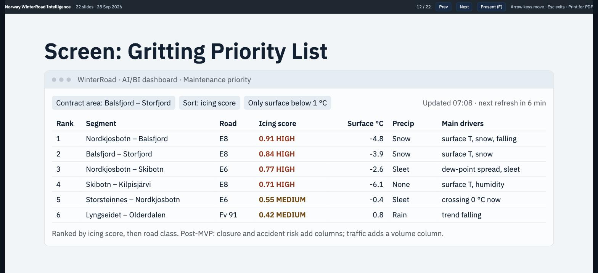
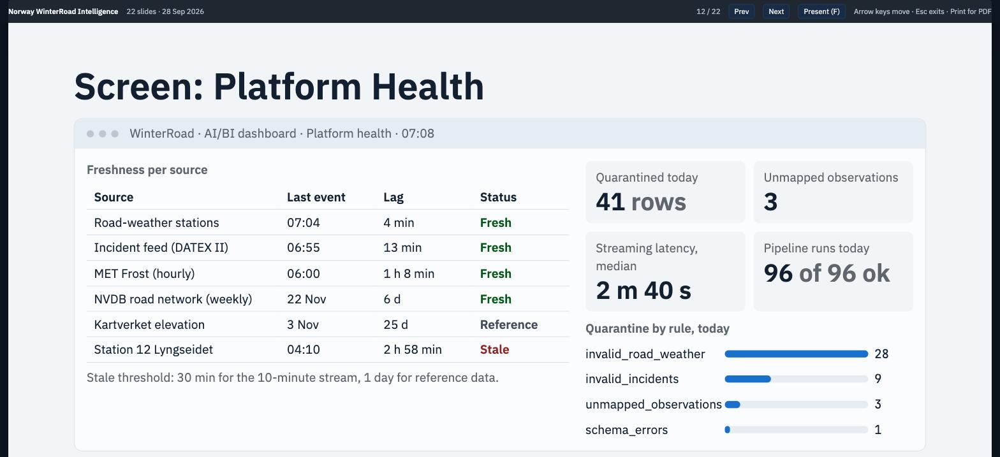

# FrostSight

FrostSight estimates and explains winter road hazard on the Norwegian road network. It turns 10-minute
road-weather measurements, road incidents and the national road database (NVDB) into a risk level per road
segment, with the measurements that drive it. The first slice covers icing risk for Troms county.

**Active track (ADR-0005):** a local prototype — synthetic road-weather data, a small **PyTorch** icing-risk
model, and a **Plotly Dash** dashboard. No cloud account or credentials needed; runs on a laptop.
The original Databricks-first plan (`docs/plan/`) is kept as domain reference, not the current roadmap.



## Run the prototype

```bash
python -m venv .venv && source .venv/bin/activate
pip install -r prototype/requirements.txt

python -m prototype.train   # synthetic data + PyTorch model -> prototype/artifacts/
python -m prototype.app     # http://127.0.0.1:8050
```

See [prototype/README.md](prototype/README.md) for what each file does and its known limits.

### What it looks like running

| Risk map | Gritting priority list |
|---|---|
|  |  |

### Product vision (from the design deck)

| Road detail | Gritting priority list | Platform health |
|---|---|---|
|  |  |  |

## Documentation

| Document | What it covers |
|---|---|
| [docs/adr/0005-mvp-pivot-local-prototype.md](docs/adr/0005-mvp-pivot-local-prototype.md) | Why the active track is the local prototype, not Databricks |
| [prototype/README.md](prototype/README.md) | How to run the prototype, what each file does |
| [docs/overview.md](docs/overview.md) | Problem, scope, ownership, users and use cases |
| [docs/architecture.md](docs/architecture.md) | Data flow, design rules, integrations (Databricks track) |
| [docs/adr/](docs/adr/) | Architecture decisions, 0001–0004 domain research, 0005 the current direction |
| [docs/plan/](docs/plan/00_README.md) | Superseded Databricks implementation plan, kept as reference |
| [docs/platform-targets.md](docs/platform-targets.md) | Free Edition and AWS targets, limits and cost (Databricks track) |
| [docs/source-verification.md](docs/source-verification.md) | Live checks of every data source |

## Repository layout

```
prototype/         active track: synthetic data, PyTorch model, Dash dashboard (ADR-0005)
docs/adr/          architecture decisions, including ADR-0005 (the pivot)
docs/plan/         superseded Databricks implementation plan, kept as reference
docs/images/       screenshots used in this README

databricks.yml     Asset Bundle: variables and the free, personal and aws targets (Databricks track)
resources/         pipeline, job and dashboard definitions
src/frostsight/    Python package: transforms, windows, risk engine
src/pipelines/     Lakeflow Declarative Pipeline source
src/jobs/          job entry points
src/dashboards/    AI/BI dashboard definitions
collector/         source collector, runs outside Databricks
replay/            storm replay harness
sql/               one-time workspace setup
config/            source inventory and rule configuration
tools/             developer utilities
tests/             unit tests, data tests, fixtures
```

## Data sources and attribution

Road data from Statens vegvesen (NVDB, DATEX II) under the Norwegian Licence for Open Government Data
(NLOD). Weather data from MET Norway and Open-Meteo under CC BY 4.0. The prototype above uses synthetic
data only — see `prototype/README.md`.
